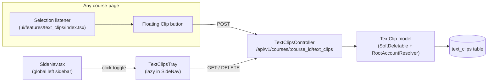

# Text Clipper — Implementation Plan

Choices locked in: **1A** SideNav (global left sidebar), **2A** TypeScript + `sessionStorage`, **3B** sharded migration with `root_account_id` + `replica_identity_index`.

## Architecture at a glance



## Backend (Rails)

### 1. Migration — `db/migrate/<TIMESTAMP>_create_text_clips.rb`

Use `ActiveRecord::Migration[8.0]`, `tag :predeploy`, modeled after [`db/migrate/20260326140109_create_translation_feedback.rb`](db/migrate/20260326140109_create_translation_feedback.rb):

```ruby
create_table :text_clips do |t|
  t.references :root_account, foreign_key: { to_table: :accounts }, null: false, index: false
  t.references :user, null: false, foreign_key: true
  t.references :course, null: true, foreign_key: true   # nullable: global-scope ready
  t.text :content, null: false
  t.string :source_url, limit: 2048
  t.string :workflow_state, default: "active", null: false, limit: 255
  t.timestamps

  t.replica_identity_index
  t.index %i[user_id course_id workflow_state], where: "workflow_state <> 'deleted'"
  t.check_constraint "workflow_state IN ('active', 'deleted')", name: "chk_text_clips_workflow_state_enum"
end
```

### 2. Model — `app/models/text_clip.rb`

Mirror [`app/models/planner_note.rb`](app/models/planner_note.rb), add `RootAccountResolver`:

```ruby
class TextClip < ApplicationRecord
  include Canvas::SoftDeletable
  extend RootAccountResolver

  resolves_root_account through: :course

  belongs_to :root_account, class_name: "Account"
  belongs_to :user
  belongs_to :course, optional: true

  validates :user_id, presence: true
  validates :content, presence: true, length: { maximum: 50_000 }
  validates :source_url, length: { maximum: 2048 }, allow_nil: true

  scope :for_user, ->(user) { where(user:) }
  scope :for_course, ->(course) { where(course:) }
end
```

### 3. JSON serializer — `lib/api/v1/text_clip.rb`

Mirror [`lib/api/v1/planner_note.rb`](lib/api/v1/planner_note.rb):

```ruby
module Api::V1::TextClip
  include Api::V1::Json
  API_JSON_OPTS = { only: %w[id content source_url user_id course_id workflow_state created_at updated_at] }.freeze

  def text_clip_json(clip, user, session, opts = {})
    api_json(clip, user, session, opts.merge(API_JSON_OPTS))
  end

  def text_clips_json(clips, user, session, opts = {})
    clips.map { |c| text_clip_json(c, user, session, opts) }
  end
end
```

### 4. Controller — `app/controllers/text_clips_controller.rb`

Mirror [`app/controllers/planner_notes_controller.rb`](app/controllers/planner_notes_controller.rb). Three actions: `index`, `create`, `destroy`. Always scope through `@current_user.text_clips` and use `authorized_action(course, @current_user, :read)`.

- `index`: `@current_user.text_clips.active.for_course(course).order(created_at: :desc)`
- `create`: validate `:content` presence, set `course`, set `root_account` (resolver handles it from course), return 201
- `destroy`: `find` via `@current_user.text_clips` (returns 404 cross-user — satisfies FR-06), call `destroy` (soft-delete via `Canvas::SoftDeletable`), return 200

Add `before_action :require_user` and `before_action :check_limited_access_for_students` to match `PlannerNotesController`.

### 5. User association — `app/models/user.rb`

Add next to `has_many :planner_notes` (line 83):

```ruby
has_many :text_clips, dependent: :destroy
```

### 6. Routes — `config/routes.rb`

Add inside the existing `ApiRouteSet::V1.draw(self) do` block (the one starting at line 1227), placed near the planner_notes block (around line 2886):

```ruby
scope(controller: :text_clips) do
  get    "courses/:course_id/text_clips",     action: :index,   as: :course_text_clips
  post   "courses/:course_id/text_clips",     action: :create
  delete "courses/:course_id/text_clips/:id", action: :destroy
end
```

## Frontend (TypeScript / React)

### 7. Selection listener bundle — `ui/features/text_clips/index.tsx`

A new feature bundle responsible for the floating "Clip" button on text selection. Mounts a small React app to a `<div id="text-clips-selection-mount">` and:

- Listens to `document` `selectionchange` / `mouseup` events
- Skips selection inside `[contenteditable]`, `<textarea>`, `<input>`, and any element matching `.tox-edit-area, .CodeMirror, .ql-editor, .RceWrapper` (Canvas TinyMCE/RCE selectors) — satisfies FR-07
- Renders a small floating `IconButton` near the selection bounding rect; on click, POSTs `{ content, source_url: window.location.href }` to `/api/v1/courses/${ENV.COURSE_ID}/text_clips` via `doFetchApi`
- Only mounts when `window.ENV.COURSE_ID` is present (course pages only)
- On success, broadcasts a `text-clips:created` `CustomEvent` so the open tray (if any) can re-fetch

Files:
- `ui/features/text_clips/index.tsx` (entry, mounts the listener)
- `ui/features/text_clips/components/SelectionClipButton.tsx`
- `ui/features/text_clips/api.ts` (typed `doFetchApi` wrappers)
- `ui/features/text_clips/types.ts` (`TextClip` interface)
- `ui/features/text_clips/__tests__/SelectionClipButton.test.tsx` (RTL + MSW)

Wire-up: add a single line to [`app/views/layouts/application.html.erb`](app/views/layouts/application.html.erb) (or the most appropriate shared layout) inside an `if @context.is_a?(Course)` guard:

```erb
<% if @context.is_a?(Course) %><% js_bundle :text_clips %><% end %>
```

(Will verify the exact correct layout file during implementation; the convention is `js_bundle :<feature_folder_name>`.)

### 8. Tray — added to `SideNav.tsx`

Edit [`ui/features/navigation_header/react/SideNav.tsx`](ui/features/navigation_header/react/SideNav.tsx). Following the existing `CoursesTray`/`HelpTray`/`ProfileTray` pattern:

a. Add a lazy import alongside the others (around line 63):
```tsx
const TextClipsTray = React.lazy(() => import('./trays/TextClipsTray'))
```

b. Add a new `<SideNavBar.Item id="text-clips-tray">` with `IconBookmarkLine` (or similar InstUI icon), gated by `window.ENV.COURSE_ID` so it only appears on course pages — satisfies FR-04 within course scope while still being part of the global nav infrastructure. Place it above the Help item.

c. Add a case to the `activeTray` switch (around lines 543-552):
```tsx
{activeTray === 'textClips' && <TextClipsTray />}
```

d. Add `'textClips'` to `getTrayLabel` in `ui/features/navigation_header/react/utils.tsx`.

### 9. Tray content — `ui/features/navigation_header/react/trays/TextClipsTray.tsx`

New file mirroring the structure of [`ui/features/navigation_header/react/trays/HelpTray.tsx`](ui/features/navigation_header/react/trays/HelpTray.tsx) and `CoursesTray.tsx`. Inside:

- Use Tanstack Query (`useQuery` keyed `['text_clips', courseId]`) to fetch via `doFetchApi`
- Render a header with the course name, then a `List` of `TextClipItem` components
- Empty state: friendly message ("No clips yet — highlight text on a page and click Clip")
- Each item shows truncated content + delete `IconButton` → `useMutation` calls DELETE, then `queryClient.invalidateQueries`
- Listen for the `text-clips:created` `CustomEvent` and invalidate the query so newly-created clips appear without re-opening

### 10. Open-state persistence (FR-05)

In `SideNav.tsx`, when `activeTray === 'textClips'` opens or closes, also write `sessionStorage.setItem('text_clips_tray_open:' + ENV.COURSE_ID, '1' | '0')`. On `SideNav` mount, read that key and dispatch `SET_ACTIVE_TRAY: 'textClips'` + `SET_IS_TRAY_OPEN: true` if it was `'1'`. Keyed by course so navigating to a different course starts fresh. (Cleared automatically when the browser tab closes — sessionStorage semantics.)

## Tests

- `spec/models/text_clip_spec.rb` — required validations, scopes, soft-delete, root_account resolution. (Use the [.claude/skills/rspec/SKILL.md](/.claude/skills/rspec/SKILL.md) skill when authoring.)
- `spec/controllers/text_clips_controller_spec.rb` — `index`/`create`/`destroy`, cross-user 404 (FR-06), unauthorized course 401, soft-delete behavior (FR-03 backend half).
- `ui/features/text_clips/__tests__/SelectionClipButton.test.tsx` — appears outside editors, suppressed inside `[contenteditable]`/`.tox-edit-area`/`.RceWrapper` (FR-07), POST on click via MSW.
- `ui/features/navigation_header/react/trays/__tests__/TextClipsTray.test.tsx` — empty state, list render, delete button calls API and removes item (FR-02, FR-03 frontend half).
- FR-05 (cross-navigation persistence) is verified manually per the research doc.

## Manual verification checklist

- [ ] FR-01: Highlight text → Clip → row appears in DB with correct user_id/course_id/content
- [ ] FR-02: Tray shows only my clips for current course, newest first
- [ ] FR-03: Delete removes item from tray without page reload; DB row has `workflow_state='deleted'`
- [ ] FR-04: Toggle visible in left sidebar on every course page (gated by `ENV.COURSE_ID`)
- [ ] FR-05: Open tray, navigate to another page in same course, tray re-opens; navigate to a different course, tray starts closed
- [ ] FR-06: Sign in as User B, GET endpoint does not return User A's clips
- [ ] FR-07: Selection inside RCE/discussion reply/wiki edit does not show Clip button

## Build / run

Inside the web container:
```
docker compose run --rm web bundle exec rails db:migrate
docker compose run --rm web bin/rspec spec/models/text_clip_spec.rb spec/controllers/text_clips_controller_spec.rb
yarn test ui/features/text_clips ui/features/navigation_header/react/trays/__tests__/TextClipsTray.test.tsx
yarn check:ts
bin/rubocop app/models/text_clip.rb app/controllers/text_clips_controller.rb lib/api/v1/text_clip.rb
```

## Out of scope (per handoff doc)

Global (course-less) clips UI, clip editing, grouping/tabs, search/filter, sharing.