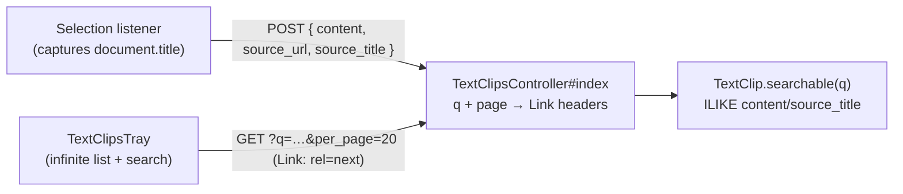

# Text Clipper — Slice 2 plan

Slice 1 (MVP) is complete: create, list, delete, sharded soft-deletable model, tray with TanStack Query, `sessionStorage` open-state. Files in place: `db/migrate/20260514120000_create_text_clips.rb`, `app/models/text_clip.rb`, `app/controllers/text_clips_controller.rb`, `lib/api/v1/text_clip.rb`, `ui/features/text_clips/*`, `ui/features/navigation_header/react/trays/TextClipsTray.tsx`.

Slice 2 makes the tray usable as the list grows — search, paginate, and link back to the source page. It explicitly **does not** introduce editing, tagging, global (course-less) clips, or sharing.

## Architecture delta



Net new column: **`text_clips.source_title`** (string, 512).
No changes to indexes; search uses ILIKE on the existing partial-active scope and is acceptable for a per-user list.

## Backend (Rails)

### 1. Migration — add `source_title`

Predeploy, modeled after the existing `CreateTextClips`:

```ruby
class AddSourceTitleToTextClips < ActiveRecord::Migration[8.0]
  tag :predeploy

  def change
    add_column :text_clips, :source_title, :string, limit: 512
  end
end
```

### 2. Model — `app/models/text_clip.rb`

Add `source_title` validation and a `searchable` scope. The scope must be safe to no-op on blank input so the controller can chain it unconditionally:

```ruby
validates :source_title, length: { maximum: 512 }, allow_nil: true

scope :searchable, ->(q) {
  next all if q.blank?
  pattern = "%#{sanitize_sql_like(q)}%"
  where("content ILIKE :p OR source_title ILIKE :p", p: pattern)
}
```

Use `SearchTermHelper.valid_search_term?` at the controller layer (not in the scope) so empty `q` is still allowed for the default unfiltered list.

### 3. Serializer — `lib/api/v1/text_clip.rb`

Add `source_title` to `API_JSON_OPTS[:only]`. No other changes.

### 4. Controller — `app/controllers/text_clips_controller.rb`

`index`:

```ruby
def index
  q = params[:q].to_s
  if q.present? && !SearchTermHelper.valid_search_term?(q)
    return render json: { errors: [{ message: "search term must be at least 2 characters" }] },
                  status: :unprocessable_entity
  end

  clips = @context.shard.activate do
    @current_user.text_clips
                 .active
                 .for_course(@context)
                 .searchable(q)
                 .order(created_at: :desc)
  end
  paginated = Api.paginate(clips, self, api_v1_course_text_clips_url(@context))
  render json: text_clips_json(paginated, @current_user, session)
end
```

`create`: permit `:source_title` in `create_params` and assign it on `build`. Mirror the Slice-1 `presence` handling so an empty string is stored as `nil`.

`destroy`: unchanged.

### 5. Routes

No change — `as: :course_text_clips` already exists and gives `api_v1_course_text_clips_url` for `Api.paginate`.

## Frontend (TypeScript / React)

### 6. Capture `document.title` at clip time

`ui/features/text_clips/types.ts` — add `source_title?: string | null` to `TextClipRecord` and a `TextClipCreate` body type that includes it.

`ui/features/text_clips/api.ts` — extend the `createTextClip` body shape:

```ts
export async function createTextClip(
  courseId: string | number,
  body: { content: string; source_url?: string; source_title?: string },
): Promise<TextClipRecord> { /* … */ }
```

`ui/features/text_clips/index.tsx` — in the `onClip` handler, also pass `source_title: document.title.slice(0, 512)`.

### 7. Tray — search + infinite list + source link

Edit `ui/features/navigation_header/react/trays/TextClipsTray.tsx`. Mirror the Link-header pattern already used in [`ui/features/navigation_header/react/lists/HistoryList.tsx`](ui/features/navigation_header/react/lists/HistoryList.tsx):

a. **Search input** (InstUI `TextInput`) at the top of the tray, with a small debounce (`~250ms`) before it triggers a query refetch. Use a local `searchTerm` state and a `debouncedSearch` state.

b. **Switch to `useInfiniteQuery`** keyed `['text_clips', courseId, debouncedSearch]`:

```ts
const fetchClipsPage = async ({pageParam}: {pageParam: string}) => {
  const {json, link} = await doFetchApi<TextClipRecord[]>({path: pageParam})
  return {json: json ?? [], nextPage: link?.next?.url ?? null}
}

useInfiniteQuery({
  queryKey: ['text_clips', courseId, debouncedSearch],
  queryFn: fetchClipsPage,
  getNextPageParam: page => page.nextPage ?? undefined,
  initialPageParam:
    `/api/v1/courses/${courseId}/text_clips?per_page=20` +
    (debouncedSearch ? `&q=${encodeURIComponent(debouncedSearch)}` : ''),
  enabled: Boolean(courseId),
})
```

c. **`fetchTextClips`** in `api.ts`: change/extend the existing function (or add `fetchTextClipsPage`) so it returns `{json, nextPage}`. The tray uses the page variant; the existing function can remain as a thin wrapper for tests that don't care about pagination.

d. **Per-item source link**: when `clip.source_url` is present, render an `IconExternalLinkLine` `IconButton` (or a small InstUI `Link`) that opens `clip.source_url` in a new tab. Use `clip.source_title || new URL(clip.source_url).host` as the visible label / `screenReaderLabel`. Wrap in a `try`/`catch` for malformed URLs and just fall back to the raw URL.

e. **Load more**: keep it explicit for now — a `Button` at the bottom that calls `fetchNextPage()` when `hasNextPage` is true, with `isFetchingNextPage` driving the spinner. (Intersection-observer scrolling can come later; the tray isn't tall enough to justify it yet.)

f. **No-results state**: when `debouncedSearch` is set and `data.pages` is empty, show "No clips match '<term>'" instead of the existing empty state.

`text-clips:created` listener: keep it; on event, `queryClient.invalidateQueries({queryKey: ['text_clips', courseId]})` (predicate match all search terms) so a new clip shows up even when a search is active.

## Tests

- **`spec/models/text_clip_spec.rb`** — add cases for `source_title` length, `searchable` matching on both fields, `searchable` no-op for blank `q`.
- **`spec/controllers/text_clips_controller_spec.rb`**:
  - `index` returns a `Link` header with `rel="next"` when there are more than `per_page` clips
  - `q` filters results across `content` and `source_title`
  - `q` of length 1 returns 422
  - `create` accepts and stores `source_title`
- **`ui/features/text_clips/__tests__/SelectionClipButton.test.tsx`** — assert the POST body now includes `source_title` from `document.title`.
- **`ui/features/navigation_header/react/trays/__tests__/TextClipsTray.test.tsx`**:
  - typing in the search input (after debounce) issues a GET with `q=…`
  - a `Link: …; rel="next"` header drives a visible "Load more" that, when clicked, fetches and appends
  - each item renders the source link with `source_title` text
  - empty-results state for non-empty `q`

## Manual verification checklist

- [ ] Create > 25 clips, open the tray: first page renders, "Load more" appears
- [ ] Click "Load more": next page appends without re-fetching the first page
- [ ] Search for a substring present only in `source_title`: clip appears
- [ ] Search for a substring present only in `content`: clip appears
- [ ] Search for one character: tray shows an inline error / 422 surfaced as a toast (no list mutation)
- [ ] Click a clip's source link: opens `source_url` in a new tab; label shows the captured page title
- [ ] Create a clip → tray, even with a search active, shows the new clip if it matches (or stays as-is if not)
- [ ] Cross-user isolation still holds (Slice-1 invariant, regression check)

## Build / run

Use the [canvas-native-rspec](../.cursor/skills/canvas-native-rspec/SKILL.md) skill when running specs directly on the host. Otherwise inside the web container:

```
docker compose run --rm web bundle exec rails db:migrate
docker compose run --rm web bin/rspec spec/models/text_clip_spec.rb spec/controllers/text_clips_controller_spec.rb
yarn test ui/features/text_clips ui/features/navigation_header/react/trays/__tests__/TextClipsTray.test.tsx
yarn check:ts
bin/rubocop app/models/text_clip.rb app/controllers/text_clips_controller.rb lib/api/v1/text_clip.rb db/migrate/*_add_source_title_to_text_clips.rb
```

## Out of scope (deferred to Slice 3+)

- **Editing** clip content (PATCH + modal)
- **Tags / colors / groups**
- **Global (course-less) clips** UI (the column is already nullable)
- **Sharing** clips between users
- **Bulk delete / undo**
- **Highlight-restoration**: navigating to `source_url` and re-highlighting the clipped text in the page
