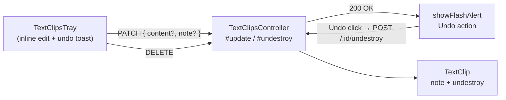

# Text Clipper — Slice 3 plan

Slices 1–2 give us: course-scoped clips, search, pagination, source link, sharded soft-delete. Now we make the tray a place users can actually **maintain**: fix typos, annotate, and recover from misclicks. One new column (`note`), one new verb on the model API (`undestroy` is already provided by `Canvas::SoftDeletable`), one PATCH route, and one undo route.

## Architecture delta



Net new column: **`text_clips.note`** (text, soft-capped at 10k chars by validation).
No index needed; per-user lists are short and already filtered through `for_course` + the partial active index.

## Backend (Rails)

### 1. Migration — add `note`

Predeploy:

```ruby
class AddNoteToTextClips < ActiveRecord::Migration[8.0]
  tag :predeploy

  def change
    add_column :text_clips, :note, :text
  end
end
```

### 2. Model — `app/models/text_clip.rb`

```ruby
validates :note, length: { maximum: 10_000 }, allow_nil: true

scope :searchable, lambda { |q|
  next all if q.blank?

  pattern = "%#{sanitize_sql_like(q)}%"
  where("content ILIKE :p OR source_title ILIKE :p OR note ILIKE :p", p: pattern)
}
```

No other model changes — `Canvas::SoftDeletable#undestroy` already flips `workflow_state` back to `"active"`.

### 3. Serializer — `lib/api/v1/text_clip.rb`

Add `:note` to `API_JSON_OPTS[:only]`.

### 4. Controller — `app/controllers/text_clips_controller.rb`

Add two actions, modeled after the existing destroy / Slice-2 update patterns. Wrap both in `@context.shard.activate` and scope through `@current_user.text_clips` so cross-user access yields 404, matching FR-06.

```ruby
before_action :check_limited_access_for_students, only: %i[index create update destroy undestroy]

# @API Update a text clip
def update
  clip = find_clip_for_current_user(active: true)
  return clip unless clip.is_a?(TextClip)

  if clip.update(update_params)
    render json: text_clip_json(clip, @current_user, session)
  else
    render json: clip.errors, status: :bad_request
  end
end

# @API Restore a soft-deleted clip
def undestroy
  clip = find_clip_for_current_user(active: false)
  return clip unless clip.is_a?(TextClip)

  if clip.deleted?
    @context.shard.activate { clip.undestroy }
  end
  render json: text_clip_json(clip, @current_user, session)
end

private

def find_clip_for_current_user(active:)
  scope = @current_user.text_clips.for_course(@context)
  scope = scope.active if active
  @context.shard.activate { scope.find(params[:id]) }
rescue ActiveRecord::RecordNotFound
  render json: { errors: [{ message: "not found" }] }, status: :not_found
  nil
end

def update_params
  params.permit(:content, :note)
end
```

Refactor the existing `destroy` to use `find_clip_for_current_user(active: true)` so all three actions share one lookup/404 path. Behavior preserved.

### 5. Routes — `config/routes.rb`

Inside the existing `scope(controller: :text_clips)` block:

```ruby
put    "courses/:course_id/text_clips/:id",            action: :update
post   "courses/:course_id/text_clips/:id/undestroy",  action: :undestroy, as: :undestroy_course_text_clip
```

## Frontend (TypeScript / React)

### 6. API + types — `ui/features/text_clips/{api.ts,types.ts}`

```ts
export type TextClipUpdate = { content?: string; note?: string }

export async function updateTextClip(
  courseId: string | number,
  id: string | number,
  body: TextClipUpdate,
): Promise<TextClipRecord>

export async function undeleteTextClip(
  courseId: string | number,
  id: string | number,
): Promise<TextClipRecord>
```

`undeleteTextClip` POSTs to `/api/v1/courses/:cid/text_clips/:id/undestroy`. Add `note?: string | null` to `TextClipRecord`.

### 7. Inline edit — `ui/features/navigation_header/react/trays/TextClipsTray.tsx`

For each list item:

- Add an **Edit** `IconButton` next to Delete + source link.
- When clicked, swap the content/note preview for two stacked `TextArea`s (one for `content`, one for `note` with a small "Note" label) plus Save and Cancel buttons.
- Save calls `useMutation(({id, body}) => updateTextClip(courseId, id, body))` and, on success, invalidates `['text_clips', courseId]` (predicate match) so the open page (including any active search) re-fetches.
- Cancel restores the original values and exits edit mode without an API call.
- Below the content preview, render the `note` (truncated, italic) when present so the user sees their annotation at a glance.
- Keep the existing Slice-2 layout (source link, delete, Load more) intact; edit only mutates a single item's render.

State: one `editingId: string | number | null` plus per-item draft `content`/`note` stored in a small `useState` tuple. No reducer needed; only one item is editable at a time. Reset `editingId` on `text-clips:created` and on tray close.

### 8. Undo delete

After the existing delete mutation succeeds:

```ts
onSuccess: (_data, id) => {
  void queryClient.invalidateQueries({queryKey: ['text_clips', courseId]})
  showFlashAlert({
    message: I18n.t('Clip deleted'),
    type: 'success',
    // Whichever of these the installed @instructure/platform-alerts version
    // supports — pick during implementation by inspecting its TS surface:
    //   action: { label: I18n.t('Undo'), onClick: () => undoMutation.mutate(id) }
    // Fall back to rendering a small InstUI Alert inside the tray with an
    // Undo button if the flash API doesn't expose actions.
  })
}
```

Concretely: probe `@instructure/platform-alerts` (currently `0.2.0`) for an `action` / `actions` field. If present, use it. If not, render an in-tray dismissable `Alert` below the search input listing the last-deleted clip with an Undo button, auto-hiding after ~8 s.

`undoMutation` calls `undeleteTextClip(courseId, id)` and invalidates the query on success.

## Tests

- **`spec/models/text_clip_spec.rb`**:
  - `note` rejects > 10_000 chars; nil and empty allowed.
  - `searchable` matches `note` (in addition to existing content/source_title cases).
- **`spec/controllers/text_clips_controller_spec.rb`**:
  - `PUT update` updates content and/or note on the current user's clip; returns the serialized clip.
  - `PUT update` returns 404 for another user's clip and for a clip in another course.
  - `PUT update` returns 400 when validations fail (e.g., empty content).
  - `POST undestroy` flips `workflow_state` back to `"active"` for a previously soft-deleted clip.
  - `POST undestroy` is **idempotent** on an active clip (200, unchanged).
  - `POST undestroy` returns 404 for another user's clip.
- **`ui/features/text_clips/__tests__/api.test.ts`** — `updateTextClip` and `undeleteTextClip` issue the correct method+path+body.
- **`ui/features/navigation_header/react/trays/__tests__/TextClipsTray.test.tsx`**:
  - Clicking Edit reveals two textareas; Save fires PATCH with merged body; Cancel reverts without an API call.
  - After delete, an Undo affordance is visible; clicking it issues a POST to `/undestroy` and the clip reappears (or the deletion is rolled back in the cache).
  - Note text is rendered under content when present.

## Manual verification checklist

- [ ] Edit a clip's content → tray reflects the new content, DB row updated, `updated_at` advances.
- [ ] Add a note → note preview shows under content; search by note substring finds the clip.
- [ ] Cancel an edit → no PATCH request fires; original content/note unchanged.
- [ ] Edit a clip you don't own (by URL surgery) → 404.
- [ ] Delete → Undo within ~8 s → clip reappears in the tray; `workflow_state` is `"active"`.
- [ ] Undo after Undo (idempotent) → no error.
- [ ] Cross-user undo (forge `id`) → 404.

## Build / run

Use the [canvas-native-rspec](../skills/canvas-native-rspec/SKILL.md) skill for host RSpec. Otherwise:

```
docker compose run --rm web bundle exec rails db:migrate
docker compose run --rm web bin/rspec spec/models/text_clip_spec.rb spec/controllers/text_clips_controller_spec.rb
yarn test ui/features/text_clips ui/features/navigation_header/react/trays/__tests__/TextClipsTray.test.tsx
yarn check:ts
bin/rubocop app/models/text_clip.rb app/controllers/text_clips_controller.rb lib/api/v1/text_clip.rb db/migrate/*_add_note_to_text_clips.rb
```

## Out of scope (deferred to Slice 4+)

- **Tags / colors / groups** (next obvious slice — schema for `text_clip_tags` + filter chips in the tray).
- **Global (course-less) clips** UI.
- **Sharing** between users.
- **Bulk delete / bulk undo** (Slice 3 only does single-item undo).
- **Highlight-restoration** on `source_url`.
- **Edit conflict detection** (last-write-wins is fine while clips are single-user; revisit if sharing lands).
