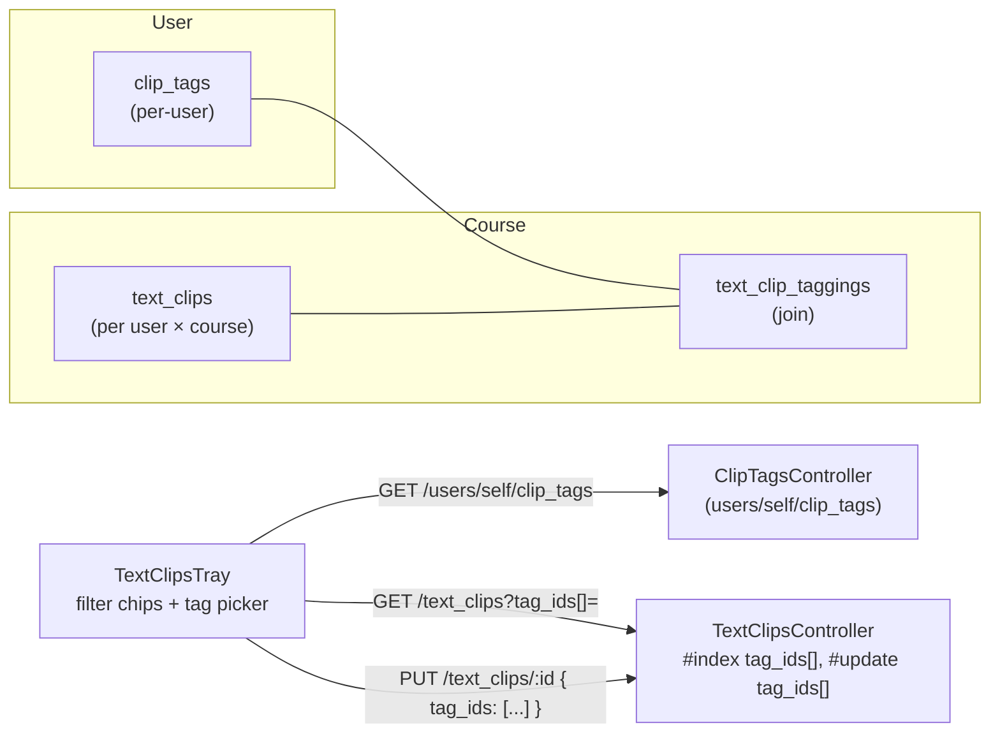

# Text Clipper — Slice 4 plan

Slices 1–3 give us: clip CRUD, soft-delete, source link, search, pagination, edit, notes, undo. Once a user accumulates 30+ clips, search alone isn't enough — they want **lateral structure**. Slice 4 adds **personal tags** (per-user, color-coded, cross-course) and the ability to **filter the tray by tag**.

Tags are deliberately **user-scoped**, not course-scoped, so the same "Important" or "Exam prep" tag works across every course the user takes. The tray remains course-scoped: it only ever shows clips for the current course, but the available tag set is global to the user.

## Architecture delta



Two new tables, both sharded, both soft-deletable. No changes to `text_clips` columns.

## Backend (Rails)

### 1. Migrations

`db/migrate/<TS>_create_clip_tags.rb` — modeled after `CreateInstitutionalTags`:

```ruby
create_table :clip_tags do |t|
  t.references :user, null: false, foreign_key: true
  t.string :name, null: false, limit: 64
  t.string :color, null: false, default: "blue", limit: 32
  t.string :workflow_state, null: false, default: "active", limit: 255
  t.references :root_account, null: false, foreign_key: { to_table: :accounts }, index: false
  t.timestamps

  t.check_constraint "workflow_state IN ('active', 'deleted')", name: "chk_clip_tags_workflow_state_enum"
  t.replica_identity_index
  t.index "user_id, LOWER(name)",
          unique: true,
          where: "workflow_state = 'active'",
          name: "index_clip_tags_on_user_id_lower_name_active"
end
```

`db/migrate/<TS+1>_create_text_clip_taggings.rb`:

```ruby
create_table :text_clip_taggings do |t|
  t.references :text_clip, null: false, foreign_key: true
  t.references :clip_tag,  null: false, foreign_key: true
  t.references :root_account, null: false, foreign_key: { to_table: :accounts }, index: false
  t.string :workflow_state, null: false, default: "active", limit: 255
  t.timestamps

  t.check_constraint "workflow_state IN ('active', 'deleted')", name: "chk_text_clip_taggings_workflow_state_enum"
  t.replica_identity_index
  t.index %i[text_clip_id clip_tag_id],
          unique: true,
          where: "workflow_state = 'active'",
          name: "index_text_clip_taggings_unique_active"
end
```

### 2. Models

`app/models/clip_tag.rb`:

```ruby
class ClipTag < ApplicationRecord
  extend RootAccountResolver
  include Canvas::SoftDeletable

  PALETTE = %w[blue green orange purple red gray yellow pink].freeze

  belongs_to :user
  has_many :text_clip_taggings, dependent: :destroy
  has_many :text_clips, through: :text_clip_taggings

  resolves_root_account through: :user

  validates :name, presence: true, length: { maximum: 64 }
  validates :color, inclusion: { in: PALETTE }
  validates :workflow_state, presence: true
  validates :name, uniqueness: { scope: :user_id, conditions: -> { active }, case_sensitive: false }

  scope :for_user, ->(user) { where(user:) }
end
```

`app/models/text_clip_tagging.rb`:

```ruby
class TextClipTagging < ApplicationRecord
  extend RootAccountResolver
  include Canvas::SoftDeletable

  belongs_to :text_clip
  belongs_to :clip_tag

  resolves_root_account through: :text_clip

  validates :workflow_state, presence: true
  validates :clip_tag_id, uniqueness: {
    scope: :text_clip_id,
    conditions: -> { active },
    case_sensitive: false,
    message: "tag already applied to this clip"
  }
end
```

`app/models/text_clip.rb` additions:

```ruby
has_many :text_clip_taggings, dependent: :destroy
has_many :clip_tags, -> { active }, through: :text_clip_taggings

scope :with_any_tag, ->(tag_ids) {
  next all if Array(tag_ids).compact.blank?

  joins(:text_clip_taggings)
    .where(text_clip_taggings: { clip_tag_id: tag_ids, workflow_state: "active" })
    .distinct
}
```

`app/models/user.rb` additions:

```ruby
has_many :clip_tags, dependent: :destroy, multishard: true
```

### 3. Serializers

`lib/api/v1/clip_tag.rb`:

```ruby
module Api::V1::ClipTag
  include Api::V1::Json

  API_JSON_OPTS = {
    only: %w[id name color workflow_state created_at updated_at]
  }.freeze

  def clip_tag_json(tag, user, session, opts = {})
    api_json(tag, user, session, opts.merge(API_JSON_OPTS))
  end

  def clip_tags_json(tags, user, session, opts = {})
    tags.map { |t| clip_tag_json(t, user, session, opts) }
  end
end
```

`lib/api/v1/text_clip.rb` — change `text_clip_json` to also embed an array of tag stubs:

```ruby
def text_clip_json(clip, user, session, opts = {})
  json = api_json(clip, user, session, opts.merge(API_JSON_OPTS))
  json["tags"] = clip.clip_tags.map { |t| { "id" => t.id, "name" => t.name, "color" => t.color } }
  json
end
```

(The N+1 cost is handled by the controller preloading `:clip_tags`.)

### 4. Controllers

`app/controllers/clip_tags_controller.rb` — small CRUD scoped to `@current_user`:

```ruby
class ClipTagsController < ApplicationController
  include Api::V1::ClipTag

  before_action :require_user

  def index
    tags = @current_user.clip_tags.active.order(:name)
    paginated = Api.paginate(tags, self, api_v1_user_clip_tags_url("self"))
    render json: clip_tags_json(paginated, @current_user, session)
  end

  def create
    tag = @current_user.clip_tags.build(create_params.merge(root_account_id: @domain_root_account.id))
    if tag.save
      render json: clip_tag_json(tag, @current_user, session), status: :created
    else
      render json: tag.errors, status: :unprocessable_content
    end
  end

  def update
    tag = find_for_current_user(active: true)
    return unless tag.is_a?(ClipTag)

    if tag.update(update_params)
      render json: clip_tag_json(tag, @current_user, session)
    else
      render json: tag.errors, status: :unprocessable_content
    end
  end

  def destroy
    tag = find_for_current_user(active: true)
    return unless tag.is_a?(ClipTag)

    tag.destroy
    render json: clip_tag_json(tag, @current_user, session)
  end

  private

  def find_for_current_user(active:)
    scope = @current_user.clip_tags
    scope = scope.active if active
    scope.find(params[:id])
  rescue ActiveRecord::RecordNotFound
    render json: { errors: [{ message: "not found" }] }, status: :not_found
    nil
  end

  def create_params
    params.permit(:name, :color)
  end

  def update_params
    params.permit(:name, :color)
  end
end
```

`app/controllers/text_clips_controller.rb` changes:

- `#index` — preload `:clip_tags`; accept `tag_ids[]` (Array of integers) and chain `with_any_tag(tag_ids)`. Validate ids are integers; ignore unknown ids silently rather than 404.
- `#update` — if `tag_ids` is present in params, treat it as an **idempotent replacement** of the clip's taggings. Implementation: in the same transaction, soft-delete taggings for tags not in the new set, and `find_or_create_by` taggings for tags in the new set. Cross-user safety: only consider tag ids that belong to `@current_user.clip_tags`.
- `#create` — no change (tags are applied via `#update` after creation; selection clip stays minimal).

```ruby
def index
  q = params[:q].to_s
  return unprocessable_search_term if q.present? && !SearchTermHelper.valid_search_term?(q)

  tag_ids = Array(params[:tag_ids]).map(&:to_i).reject(&:zero?)

  clips = @context.shard.activate do
    @current_user.text_clips
                 .active
                 .for_course(@context)
                 .searchable(q)
                 .with_any_tag(tag_ids)
                 .preload(:clip_tags)
                 .order(created_at: :desc)
  end
  paginated = Api.paginate(clips, self, api_v1_course_text_clips_url(@context))
  render json: text_clips_json(paginated, @current_user, session)
end

def update
  clip = find_clip_for_current_user(active: true)
  return unless clip.is_a?(TextClip)

  attrs = normalized_update_params
  tag_ids = params.key?(:tag_ids) ? Array(params[:tag_ids]).map(&:to_i).reject(&:zero?) : nil

  ok = ActiveRecord::Base.transaction do
    attrs.empty? || clip.update(attrs) and reconcile_taggings(clip, tag_ids)
  end

  if ok
    render json: text_clip_json(clip.reload, @current_user, session)
  else
    render json: clip.errors, status: :bad_request
  end
end

private

def reconcile_taggings(clip, requested_tag_ids)
  return true if requested_tag_ids.nil?

  allowed_ids = @current_user.clip_tags.active.where(id: requested_tag_ids).pluck(:id)
  current_active = clip.text_clip_taggings.active

  to_remove = current_active.where.not(clip_tag_id: allowed_ids)
  to_remove.find_each(&:destroy)

  allowed_ids.each do |tag_id|
    existing = clip.text_clip_taggings.where(clip_tag_id: tag_id).first
    if existing
      existing.update!(workflow_state: "active") unless existing.active?
    else
      clip.text_clip_taggings.create!(clip_tag_id: tag_id)
    end
  end
  true
end
```

### 5. Routes

Inside the existing `ApiRouteSet::V1.draw` block:

```ruby
scope(controller: :clip_tags) do
  get    "users/:user_id/clip_tags",     action: :index,   as: :user_clip_tags
  post   "users/:user_id/clip_tags",     action: :create
  put    "users/:user_id/clip_tags/:id", action: :update
  delete "users/:user_id/clip_tags/:id", action: :destroy
end
```

`user_id` accepts `"self"` per Canvas convention; the controller ignores it and uses `@current_user`.

## Frontend (TypeScript / React)

### 6. API + types — `ui/features/text_clips/{api.ts,types.ts}`

```ts
export type ClipTagColor =
  | 'blue' | 'green' | 'orange' | 'purple' | 'red' | 'gray' | 'yellow' | 'pink'

export type ClipTagRecord = {
  id: number | string
  name: string
  color: ClipTagColor
  workflow_state: string
  created_at: string
  updated_at: string
}

export type TextClipRecord = {
  // …existing fields…
  tags?: Array<{ id: number | string; name: string; color: ClipTagColor }>
}

export type TextClipUpdate = {
  content?: string
  note?: string
  tag_ids?: Array<number | string>
}
```

New wrappers:

```ts
fetchClipTags(): Promise<ClipTagRecord[]>
createClipTag(body: { name: string; color: ClipTagColor }): Promise<ClipTagRecord>
updateClipTag(id, body: Partial<{ name: string; color: ClipTagColor }>): Promise<ClipTagRecord>
deleteClipTag(id): Promise<void>
```

`textClipsIndexPath` gains `opts.tagIds?: Array<number|string>` which serializes as repeated `tag_ids[]=` params.

### 7. Tray — `TextClipsTray.tsx`

Composition in render order (top → bottom):

1. **Tag filter row** — horizontally scrollable strip of `Tag`/`Pill` chips for the current user's `clip_tags`. Selected chips highlight (via filled variant); a small "Clear" `Button` appears when any are selected. Selection is local state (`selectedTagIds: Set<number|string>`) fed into the `useInfiniteQuery` key, so changing tags refetches.
2. **Search input** — unchanged.
3. **Undo alert** — unchanged.
4. **Manage tags panel (collapsed by default)** — opened by a small "Manage tags" `Button` next to "Load more" or under the filter row. Lists all tags with rename (inline `TextInput`) and delete (`IconButton`). Add-tag affordance: an inline `TextInput` + color swatch row + `Create` button. Uses `useMutation` for each verb and invalidates `['clip_tags', userId]`.
5. **Clip list** — per item, render `clip.tags` as small colored `Tag` chips below the content/note. In the **inline editor**, add a multi-select chip picker that toggles tag ids in the draft; Save sends the new `tag_ids` array along with `content`/`note`.

Tag chip color: derive from the same fixed palette (e.g., `palette[clip.tags[i].color]` → InstUI Tag variant or inline style). Keep it simple: a small object that maps palette name → InstUI `Tag` `themeOverride` or a CSS class.

State summary in the tray:

```ts
const [selectedTagIds, setSelectedTagIds] = useState<Set<number | string>>(new Set())
const [manageOpen, setManageOpen] = useState(false)
const [editDraft, setEditDraft] = useState<{
  content: string
  note: string
  tag_ids: Array<number | string>
} | null>(null)
```

The clips query becomes:

```ts
useInfiniteQuery({
  queryKey: ['text_clips', courseId, debouncedSearch, Array.from(selectedTagIds).sort()],
  // …
  initialPageParam: textClipsIndexPath(courseId, {
    q: debouncedSearch || undefined,
    tagIds: Array.from(selectedTagIds),
  }),
})
```

A new `useQuery({ queryKey: ['clip_tags'], queryFn: fetchClipTags })` powers the filter row, the manage panel, and the editor picker.

### 8. Selection clip button (out of scope this slice)

`ui/features/text_clips/index.tsx` does **not** change — newly clipped text still posts without tags. The user tags later through the tray's edit view. This keeps the selection UX latency-free and avoids forcing a tag picker at the moment of clipping.

## Tests

**Models**

- `spec/models/clip_tag_spec.rb` — presence/length of `name`, color inclusion, per-user name uniqueness (case-insensitive, active-only), root_account resolves through user, `for_user` scope, soft-delete behavior, `belongs_to :user`.
- `spec/models/text_clip_tagging_spec.rb` — unique active tagging per (clip, tag), root_account resolves through text_clip, soft-delete behavior.
- Extend `spec/models/text_clip_spec.rb` — `with_any_tag([id])` filters; `with_any_tag([])` is a no-op; `clip_tags` association returns only active tags.

**Controllers**

- `spec/controllers/clip_tags_controller_spec.rb` — full CRUD: cross-user 404; 422 on duplicate name; 422 on bad color; soft-delete on destroy.
- Extend `spec/controllers/text_clips_controller_spec.rb`:
  - `#index` with `tag_ids[]=`: returns only clips with that tag; multiple `tag_ids[]` = OR.
  - `#index` serializes `tags` array on each clip.
  - `#update` with `tag_ids: [a, b]` replaces taggings; passing `[]` removes all; tags belonging to another user are silently ignored.
  - `#update` is transactional: a content validation failure does not partially update taggings.

**Frontend**

- `ui/features/text_clips/__tests__/api.test.ts` — wrappers for clip_tags CRUD; `updateTextClip` includes `tag_ids`; `textClipsIndexPath` serializes `tag_ids[]`.
- `ui/features/navigation_header/react/trays/__tests__/TextClipsTray.test.tsx`:
  - Tag chips render under a clip with matching colors.
  - Clicking a filter chip triggers a refetch with `tag_ids[]=` in the URL; Clear resets it.
  - Editor tag picker toggles a tag → Save fires `PUT` with the new `tag_ids` array.
  - Manage panel: create produces a POST; delete soft-deletes and removes from the filter row on refetch; rename updates label.

## Manual verification checklist

- [ ] Create a tag in the manage panel; it appears in the filter row and the editor picker.
- [ ] Tag a clip via the editor; chip appears under the clip content; row remains in the tray.
- [ ] Filter by that tag; only matching clips show.
- [ ] Filter by two tags; clips having either show (OR).
- [ ] Untag a clip in the editor; chip disappears; if filter was active, clip may leave the list.
- [ ] Rename a tag; chips on all affected clips update on next refetch.
- [ ] Delete a tag; chips disappear from affected clips; filter chip is gone; `with_any_tag([deleted_id])` returns 0 clips on next fetch.
- [ ] Cross-user safety: attempt to apply another user's tag id via `PUT /text_clips/:id` — server silently strips it.
- [ ] Combined filter + search: only clips matching both the search text and at least one selected tag appear.

## Build / run

Use the [canvas-native-rspec](../skills/canvas-native-rspec/SKILL.md) skill for host RSpec. Otherwise:

```
docker compose run --rm web bundle exec rails db:migrate
docker compose run --rm web bin/rspec \
  spec/models/clip_tag_spec.rb \
  spec/models/text_clip_tagging_spec.rb \
  spec/models/text_clip_spec.rb \
  spec/controllers/clip_tags_controller_spec.rb \
  spec/controllers/text_clips_controller_spec.rb
yarn test ui/features/text_clips ui/features/navigation_header/react/trays/__tests__/TextClipsTray.test.tsx
yarn check:ts
bin/rubocop app/models/clip_tag.rb app/models/text_clip_tagging.rb app/models/text_clip.rb \
            app/controllers/clip_tags_controller.rb app/controllers/text_clips_controller.rb \
            lib/api/v1/clip_tag.rb lib/api/v1/text_clip.rb \
            db/migrate/*_create_clip_tags.rb db/migrate/*_create_text_clip_taggings.rb
```

## Out of scope (deferred to Slice 5+)

- **Global (course-less) clips view** — the column is already nullable; surface a top-level "All clips" tray entry next slice.
- **Sharing** clips between users.
- **Bulk operations** — delete-many, tag-many, undo-many.
- **Highlight-restoration** — navigating to `source_url` and re-highlighting the clipped text.
- **Smart suggestions** — auto-tagging based on URL or course.
- **Tag drag-to-reorder** in the filter row.
- **Custom colors** outside the fixed palette.
