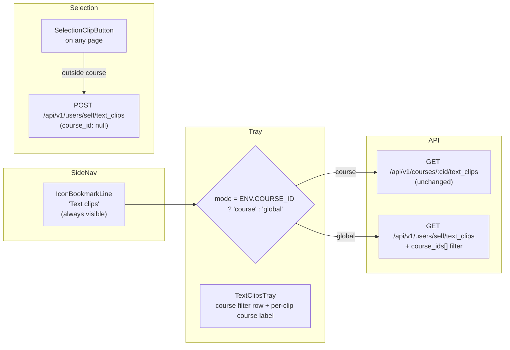

# Text Clipper — Slice 5 plan

Slices 1–4 give us course-scoped clips with notes, search, undo, and personal color-coded tags. The bookmark in the SideNav still only appears on course pages, and the tray only ever shows clips for one course. Slice 5 closes that gap: clips become a **personal collection** that the user can browse from anywhere in Canvas, and clipping works on non-course pages too.

The schema was designed for this from day one — `text_clips.course_id` has always been nullable — so this slice is mostly API surface + UI glue, with no migrations.

## Architecture delta



No new tables. No new columns. One new controller code path. One new SideNav state.

## 0. Two prerequisites you can't skip

These look like footnotes but they are the difference between "global clips work" and "POST /users/self/text_clips returns 500" or "the SelectionClipButton never appears outside a course." Land them first.

### 0a. Layout guard — `app/views/layouts/application.html.erb`

The current line:

```22:22:app/views/layouts/application.html.erb
  js_bundle(:text_clips) if @context.is_a?(Course) && @current_user
```

means the JS bundle isn't even on `/dashboard` or `/profile`, so the slice 5 selection-clip work is invisible without this change. Relax to:

```erb
<% js_bundle(:text_clips) if @current_user %>
```

The bundle's own `ready()` check already guards against double-mount, and `index.tsx` will be updated (see section 8) to handle the no-course case.

### 0b. Root account resolver — `app/models/text_clip.rb`

The migration declared `t.references :root_account, null: false`. The current model resolves it through `:course`, which is `nil` for a global clip and therefore violates the constraint at `INSERT` time. Switch to the proc form (precedent: [`app/models/role_override.rb`](app/models/role_override.rb) line 35):

```ruby
resolves_root_account through: ->(clip) { clip.course&.root_account_id || clip.user&.root_account_id }
```

`User#root_account_id` exists in Canvas (set per shard via `User#associated_root_accounts`); this preserves the current course-shard resolution for course-scoped clips and adds a working path for `course_id: nil` clips.

## Backend (Rails)

### 1. Controller — `app/controllers/text_clips_controller.rb`

The current controller assumes a course (`require_context_and_read_access` + `require_course_context`). Refactor so the same actions handle both contexts:

```ruby
before_action :require_user
before_action :load_clip_context
before_action :require_context_and_read_access, if: :course_scoped?
before_action :require_course_context,          if: :course_scoped?
before_action :check_limited_access_for_students,
              only: %i[index create update destroy undestroy],
              if: :course_scoped?

def index
  q = params[:q].to_s
  return unprocessable_search_term if q.present? && !SearchTermHelper.valid_search_term?(q)

  tag_ids    = Array(params[:tag_ids]).map(&:to_i).reject(&:zero?)
  course_ids = Array(params[:course_ids]).map(&:to_i).reject(&:zero?)

  clips = clip_query_scope do
    base = @current_user.text_clips
                        .active
                        .searchable(q)
                        .with_any_tag(tag_ids)
                        .preload(:clip_tags, :course)
    if course_scoped?
      base.for_course(@context)
    else
      base.for_courses(course_ids)
    end.order(created_at: :desc)
  end

  paginated = Api.paginate(clips, self, index_url)
  render json: text_clips_json(paginated, @current_user, session)
end

def create
  attrs = create_params.to_h.symbolize_keys
  clip = clip_query_scope do
    @current_user.text_clips.build(
      course: course_scoped? ? @context : nil,
      content: attrs[:content],
      source_url: attrs[:source_url].presence,
      source_title: attrs[:source_title].presence,
    ).tap(&:save)
  end
  if clip.persisted?
    render json: text_clip_json(clip, @current_user, session), status: :created
  else
    render json: clip.errors, status: :bad_request
  end
end

private

def load_clip_context
  @global_scope = params[:user_id].present?
end

def course_scoped?
  !@global_scope
end

def clip_query_scope(&)
  course_scoped? ? @context.shard.activate(&) : yield
end

def index_url
  course_scoped? ? api_v1_course_text_clips_url(@context) : api_v1_user_text_clips_url("self")
end

def find_clip_for_current_user(active:)
  scope = @current_user.text_clips
  scope = scope.for_course(@context) if course_scoped?
  scope = scope.active if active
  clip_query_scope { scope.find(params[:id]) }
rescue ActiveRecord::RecordNotFound
  render json: { errors: [{ message: "not found" }] }, status: :not_found
  nil
end
```

Subtleties:

- `before_action :require_context_and_read_access` only runs in course mode — otherwise we'd 403 a logged-in user with no course context.
- `find_clip_for_current_user` drops the course filter in global mode, so cross-user lookups still 404 but cross-course lookups succeed.
- `params[:user_id]` is the canonical signal because the global routes are mounted under `users/:user_id/text_clips`. We don't trust an unrouted `user_id` from the body.
- Existing course-scoped specs continue to pass because `course_scoped?` is true whenever `course_id` is in the URL.

### 2. Routes — `config/routes.rb`

Add a second `scope(controller: :text_clips)` block alongside the existing course block, inside `ApiRouteSet::V1.draw`:

```ruby
scope(controller: :text_clips) do
  get    "users/:user_id/text_clips",                action: :index,   as: :user_text_clips
  post   "users/:user_id/text_clips",                action: :create
  put    "users/:user_id/text_clips/:id",            action: :update
  delete "users/:user_id/text_clips/:id",            action: :destroy
  post   "users/:user_id/text_clips/:id/undestroy",  action: :undestroy, as: :undestroy_user_text_clip
end
```

`user_id` accepts `"self"` per Canvas convention; the controller ignores it and uses `@current_user` (matching `ClipTagsController`).

### 3. Model — `app/models/text_clip.rb`

Two changes. First, the root_account resolver fallback (also covered in section 0b):

```ruby
resolves_root_account through: ->(clip) { clip.course&.root_account_id || clip.user&.root_account_id }
```

Second, one new scope, no-op when no ids are supplied:

```ruby
scope :for_courses, ->(ids) { Array(ids).compact.blank? ? all : where(course_id: ids) }
```

Existing `for_course`, `searchable`, and `with_any_tag` already compose cleanly without an outer course filter — verified by writing the global controller specs first.

`User#text_clips` is already `multishard: true` (added in Slice 4 alongside `clip_tags`), so `@current_user.text_clips.active` natively spans every shard the user has clipped on — no further association work needed for cross-course querying.

### 4. Serializer — `lib/api/v1/text_clip.rb`

Add a minimal `course` stub so the tray can render a course label without a second roundtrip:

```ruby
def text_clip_json(clip, user, session, opts = {})
  json = api_json(clip, user, session, opts.merge(API_JSON_OPTS))
  json["tags"]   = clip.clip_tags.map { |t| { "id" => t.id, "name" => t.name, "color" => t.color } }
  json["course"] = clip.course && { "id" => clip.course.id, "name" => clip.course.name }
  json
end
```

The controller preloads `:course` in `#index` to avoid N+1; `#update` reloads with `preload(:clip_tags, :course)`.

## Frontend (TypeScript / React)

### 5. SideNav entry — `ui/features/navigation_header/react/SideNav.tsx`

Drop the `courseIdForClips` gate on the bookmark `SideNav.Item`. Persist tray-open state under a single global key (`text_clips_tray_open`) instead of one key per course id, so opening the tray on Course A and navigating to Course B keeps it open.

This is a deliberate evolution of the original FR-05 ("navigate to a different course, tray starts closed" — see [text_clipper_feature_e6166ad1.plan.md](.cursor/plans/text_clipper_feature_e6166ad1.plan.md)). Now that clips are a personal cross-course collection, the per-course key would feel wrong; the global key matches the new mental model. Worth calling out in the PR description so reviewers don't read the new behavior as a regression.

```tsx
<SideNavBar.Item
  id="text-clips-tray"
  icon={<IconBookmarkLine />}
  label={I18n.t('Text clips')}
  href="#"
  onClick={event => {
    event.preventDefault()
    handleActiveTray('textClips', true)
  }}
  selected={selectedNavItem === 'textClips'}
  data-selected={selectedNavItem === 'textClips'}
  minimized={collapseSideNav}
/>
```

### 6. Tray modes — `TextClipsTray.tsx`

Derive the mode once, at the top:

```ts
const courseId = window.ENV.COURSE_ID
const mode: 'course' | 'global' = courseId ? 'course' : 'global'
const queryKey = mode === 'course'
  ? (['text_clips', 'course', courseId, debouncedSearch, selectedTagIdsArray] as const)
  : (['text_clips', 'global', debouncedSearch, selectedTagIdsArray, selectedCourseIdsArray] as const)
```

In **global mode**:

- `initialPageParam` uses `globalTextClipsIndexPath({ q, tagIds, courseIds })`.
- Above the tag filter row, render a horizontally-scrollable strip of course chips. The course list is derived from the clips already in the cache (`new Set(clips.map(c => c.course?.id))`); we don't fetch a separate user-course list this slice — it would force pagination of its own and most users have <50 courses. If empty, show "All courses" placeholder.
  - Trade-off accepted: applying a tag filter or paginating ("Load more") will reshape the strip because the source-of-truth is the loaded clips, not a stable list of enrolled courses. That's acceptable for an MVP; a follow-up slice can swap in a dedicated `GET /api/v1/users/self/text_clips/courses` endpoint (cheap: `@current_user.text_clips.active.joins(:course).distinct.pluck('courses.id, courses.name')`) for a stable strip if it bothers users.
- Each list item renders a small `course` label under the source link:

  ```tsx
  {clip.course && (
    <Text as="div" size="x-small" color="secondary">
      {clip.course.name}
    </Text>
  )}
  ```

- The page title for empty-state copy changes: "No clips yet — highlight text in any course to save it here."

In **course mode** the tray is unchanged: no course chip strip, no per-clip course label (it would be redundant).

State summary:

```ts
const [selectedCourseIds, setSelectedCourseIds] = useState<Set<number | string>>(new Set())
const selectedCourseIdsArray = useMemo(
  () => Array.from(selectedCourseIds).sort((a, b) => String(a).localeCompare(String(b))),
  [selectedCourseIds],
)
```

### 7. API + types — `ui/features/text_clips/{api.ts,types.ts}`

```ts
export type TextClipRecord = {
  // …existing…
  course?: { id: number | string; name: string } | null
}

export function globalTextClipsIndexPath(opts?: {
  q?: string
  perPage?: number
  tagIds?: Array<number | string>
  courseIds?: Array<number | string>
}): string

export async function createGlobalTextClip(body: TextClipCreate): Promise<TextClipRecord>
export async function updateGlobalTextClip(id, body: TextClipUpdate): Promise<TextClipRecord>
export async function deleteGlobalTextClip(id): Promise<void>
export async function undeleteGlobalTextClip(id): Promise<TextClipRecord>
```

These mirror the course-scoped wrappers and POST/PUT/DELETE under `/api/v1/users/self/text_clips`. The tray picks the right pair based on `mode`. Alternatively (and probably nicer) refactor to a single wrapper that takes `{ scope: 'course' | 'global' }`. Pick whichever yields fewer diff lines in `TextClipsTray.tsx`.

### 8. Selection-clip on non-course pages — `ui/features/text_clips/index.tsx`

Drop the `!courseId` early returns:

```ts
useEffect(() => {
  // ...
}, [refreshSelection]) // no longer guarded on courseId

return (
  <SelectionClipButton
    top={clipUi.top}
    left={clipUi.left}
    onClip={async () => {
      try {
        if (courseId) {
          await createTextClip(courseId, body)
        } else {
          await createGlobalTextClip(body)
        }
        // ...
      }
    }}
  />
)
```

The `ready()` mount also stops checking `window.ENV.COURSE_ID`, so the selection overlay is available on `/profile`, `/dashboard`, etc. Clips made there have `course_id: null` and are only visible in the global tray.

## Tests

**Models**

- Extend `spec/models/text_clip_spec.rb`:
  - `for_courses([])` is a no-op (returns the same set as `.all`).
  - `for_courses([course.id])` filters correctly.
  - `for_courses([id_a, id_b])` returns clips from either (OR).
  - Creating a clip with `course: nil` populates `root_account_id` from the owning user (regression guard for the resolver fallback in section 0b).
  - Creating a clip with a course still uses the course's root_account (no regression for the existing path).

**Controllers**

- Extend `spec/controllers/text_clips_controller_spec.rb`:
  - `GET /users/self/text_clips` returns clips from every course the current user has clipped in, newest first.
  - Includes a `course` stub on each clip.
  - Honors `course_ids[]` (OR).
  - Honors `tag_ids[]` (OR) and `q` (existing matcher).
  - `POST /users/self/text_clips` without `course_id` creates a clip with `course_id: nil`.
  - `PUT /users/self/text_clips/:id` updates a clip regardless of which course it belongs to.
  - `DELETE /users/self/text_clips/:id` soft-deletes; `POST .../undestroy` restores.
  - Cross-user 404: forging another user's id still returns 404 through the global routes.
  - Course-scoped routes still pass every existing spec (no regression).

**Frontend**

- `ui/features/text_clips/__tests__/api.test.ts`:
  - `globalTextClipsIndexPath` serializes `course_ids[]`, `tag_ids[]`, and `q`.
  - `createGlobalTextClip` POSTs to `/api/v1/users/self/text_clips`.
- `ui/features/navigation_header/react/trays/__tests__/TextClipsTray.test.tsx`:
  - With no `ENV.COURSE_ID`, the tray fetches `/users/self/text_clips`, lists clips with course labels, and renders a course chip strip.
  - Clicking a course chip narrows the query (`course_ids[]=` in the URL).
  - With `ENV.COURSE_ID` set, course chips and course labels are not rendered (course-mode regression guard).
- `ui/features/text_clips/__tests__` for `index.tsx`:
  - Without `COURSE_ID`, selecting text still renders the overlay; clicking it POSTs to `/users/self/text_clips`.
  - With `COURSE_ID`, behavior is unchanged.

## Manual verification checklist

- [ ] Open the SideNav on `/dashboard` (no course) — the bookmark icon is present.
- [ ] Click it — tray opens, lists clips from every course you have clips in, with a course label on each.
- [ ] Click a course chip — only that course's clips remain.
- [ ] Click another chip — both courses' clips show (OR).
- [ ] Combine course filter + tag filter + search — all three compose.
- [ ] On `/dashboard`, highlight some text on the page — selection overlay appears; clicking it saves a clip; in the tray, that clip has no course label (it's a global clip).
- [ ] Open a course page — bookmark icon still shows; clicking it opens the **course-scoped** tray (no course chips, no per-clip course labels).
- [ ] Open the global tray, then navigate between courses — the tray stays open (single session key).
- [ ] From the global tray, delete a clip → Undo restores it; the course label survives the round trip.

## Build / run

Use the [canvas-native-rspec](../skills/canvas-native-rspec/SKILL.md) skill for host RSpec. Otherwise:

```
docker compose run --rm web bin/rspec \
  spec/models/text_clip_spec.rb \
  spec/controllers/text_clips_controller_spec.rb
yarn test ui/features/text_clips ui/features/navigation_header/react/trays/__tests__/TextClipsTray.test.tsx
yarn check:ts
bin/rubocop app/models/text_clip.rb app/controllers/text_clips_controller.rb lib/api/v1/text_clip.rb \
            app/views/layouts/application.html.erb
```

## Out of scope (deferred to Slice 6+)

- **Sharing** clips between users (next obvious slice — read-only share links first).
- **Bulk operations** — delete-many, tag-many, undo-many.
- **Highlight-restoration** — navigating to `source_url` and re-highlighting the clipped text.
- **Smart suggestions** — auto-tagging based on URL or course.
- **Dedicated `/text_clips` full-page route** — the SideNav tray covers the common case; a full page is a Slice-6 polish item.
- **Custom tag colors** outside the fixed palette.
- **Course chip ordering** — listed alphabetically by `course.name` from the cached clips; no drag-to-reorder yet.
